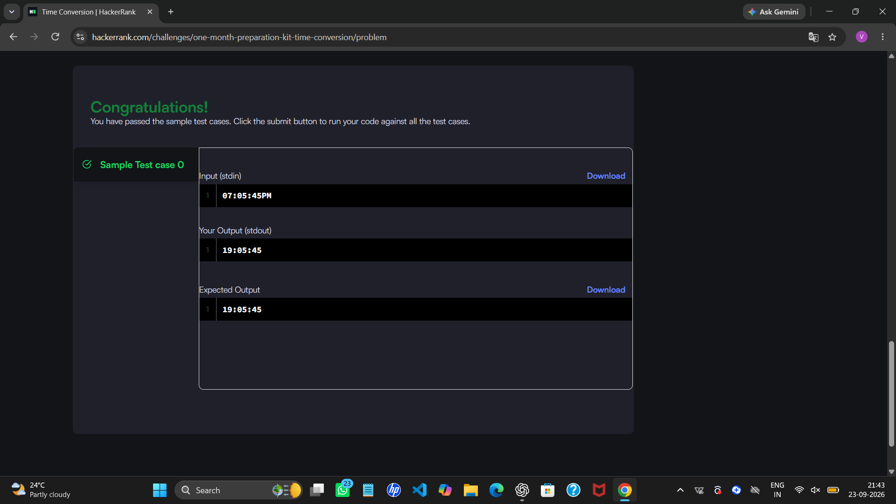
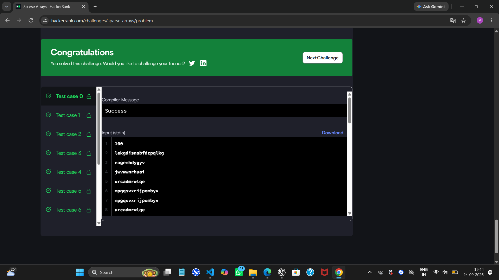

# HackerRank 3rd Semester Portfolio

## About

This repository contains my solutions for the five mandatory HackerRank problems completed as part of Activity 8: HackerRank Algorithmic Problem-Solving & Portfolio Integration.

## HackerRank Profile

[View my HackerRank Profile](https://www.hackerrank.com/profile/vasundharaajay3)

## Problems Completed

| No. | Problem | Topic | Time Complexity | Space Complexity |
|---|---|---|---|---|
| 1 | Diagonal Difference | 2D Arrays / Matrices | O(N) | O(1) |
| 2 | Dynamic Array | Data Structures / Vectors | O(N + Q) | O(N) |
| 3 | Time Conversion | Strings & Logic | O(1) | O(1) |
| 4 | Compare the Triplets | Basic Implementation | O(1) | O(1) |
| 5 | Sparse Arrays | Hash Maps / Strings | O(N + Q) | O(N) |

## Solutions

### 1. Diagonal Difference

The solution calculates the sums of the primary and secondary diagonals of a square matrix and returns their absolute difference.

[View Solution](./diagonal-difference/solution.py)

### 2. Dynamic Array

The solution uses nested sequences and bitwise XOR to process the queries.

[View Solution](./dynamic-array/solution.py)

### 3. Time Conversion

The solution converts a 12-hour AM/PM time format into 24-hour military time.

[View Solution](./time-conversion/solution.py)

### 4. Compare the Triplets

The solution compares Alice's and Bob's scores element by element and tracks their points.

[View Solution](./compare-the-triplets/solution.py)

### 5. Sparse Arrays

The solution uses frequency mapping to efficiently count occurrences of query strings.

[View Solution](./sparse-arrays/solution.py)

## HackerRank Accepted Submissions

Screenshots of the accepted HackerRank submissions are included below.

### Diagonal Difference

### Dynamic Array

### Time Conversion

### Compare the Triplets

### Sparse Arrays

## HackerRank Badge

## Reflection

A 200-word reflection on the algorithmic optimization techniques learned during this activity will be included in the final studio submission.